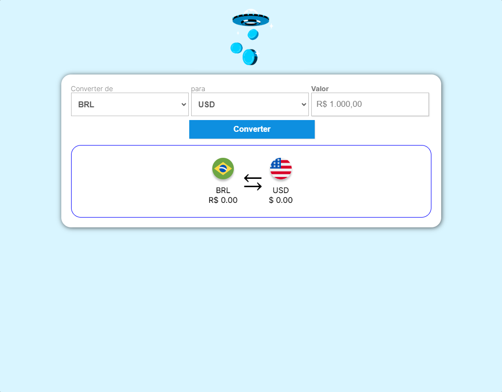

# Conversor de Moedas

## Sumário

- [Visão geral](#visão-geral)
  - [O Projeto](#o-projeto)
- [Links](#links)
- [Meu processo](#meu-processo)
  - [Tecnologias](#tecnologias-usadas)
  - [O que eu aprendi](#o-que-aprendi)
  - [Dificuldades](#dificuldades)
- [Contato](#contato)

## Visão Geral

### O Projeto

uma aplicação intuitiva e eficiente projetada para simplificar a conversão de valores entre diversas moedas do mundo. Com uma interface amigável e funcionalidades abrangentes, a aplicação atende tanto a usuários casuais quanto a profissionais que necessitam de informações precisas e atualizadas sobre câmbio.

Os usuários devem ser capazes de:

- Interagir com o layout ideal para o aplicativo, dependendo do tamanho da tela do dispositivo;
- Interagir com os estados de foco para todos os elementos interativos na página;
- Conseguir converter a quantidade de valor nas moedas desejadas.

## Links

- Repositório: https://github.com/mazziera/conversor-moedas
- Deploy: https://mazziera.github.io/conversor-moedas/

## Meu Processo

### Tecnologias usadas:

- HTML5 Semantico
- Mobile-first
- CSS3 responsivo
- Flexbox
- Javascript
- Awesome Api

### O que aprendi?

- Pude consolidar ainda mais meus conhecimentos em HTML semântico, o poder das grouping tags de facilitarem a estruturação do projeto, links posicionados de forma semântica;  
- Também o CSS responsivo com Media Queries para gerar uma melhor experiência para o usuário, independendo do dispositivo. Flexbox, elementos posicionados de forma rápida e prática. Modelo de Caixas. Tipografia. Variaveis. Displays ;  
- Awesome Api  facilitou e muito, para capturar os dados das moedas em tempo real, tornando o projeto mais completo, profissional e eliminando a possibilidade de refatorações no código.

### Dificuldades

A lógica para realizar as conversões das moedas foi um desafio a ser superado, junto com a manipulação da DOM.

## Contato

- Github - [mazziera.io](https://github.com/mazziera)
- Linkedin - [@raphael-mazzieri](https://www.linkedin.com/in/raphael-mazzieri/)